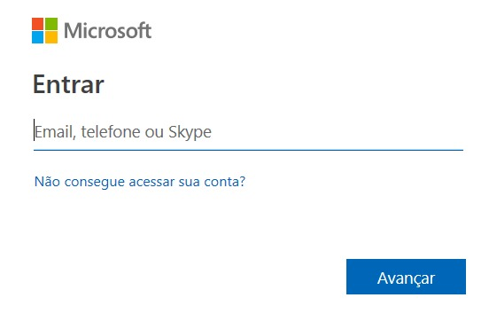

# Azure DevOps Audity

Extracting security information in Azure DevOps (formerly VSTS) can be a difficult task.
Microsoft provides an [API](https://docs.microsoft.com/en-us/rest/api/azure/devops/?view=azure-devops-rest-5.0) that allows a series of operations, but to extract from efficiently a lot of calls is required in different API modules.

This console application performs these operations in an automated manner generating a CSV with the list of the repositories, groups and users of each group, along with the permissions of each.

## Use
Please change the constant below, in `AzureDevOpsAgent.cs` for the url of your collection:

```c
const string c_collectionUri = "<YOUR COLLECTION URL>";
```

Run the application, a visual interface will appear to log in to your instance. 



It is important to emphasize that the visibility of the report will be according to the visibility that the logged in user has.
